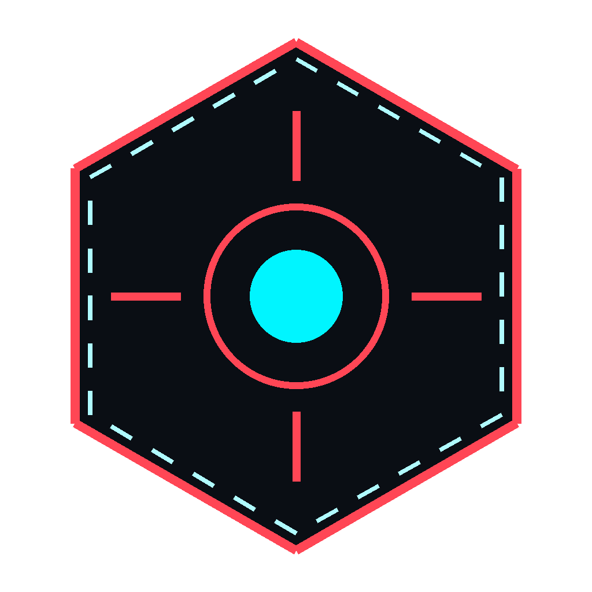

# AgainstMe

### Sistema Avançado de Análise de Adversários para Valorant

[**againstme.app**](https://againstme.app/) · Inteligência tática em tempo real

 

Aplicativo desktop para Windows que monitora suas partidas de Valorant em tempo real e entrega análise profunda de adversários, aliados e do seu próprio desempenho — 100% local, usando o Riot Client API da sua própria máquina, sem servidores externos, sem conta, sem login.

 

<table>
<tr>
<td align="center"><b>Tempo Real</b> Detecção automática polling de 2s</td>
<td align="center"><b>Todos os Modos</b> Competitivo, Unrated TDM, Spike Rush</td>
<td align="center"><b>100% Local</b> Sem cloud, sem conta Riot API direta</td>
<td align="center"><b>Tático</b> Mapa de calor de mortes Intel do inimigo</td>
</tr>
</table>

[Download e mais informações em **againstme.app**](https://againstme.app/)

---

## O que é o AgainstMe

AgainstMe é um companion app desktop para jogadores de Valorant que querem **vantagem informacional** antes de cada round. Ele lê localmente os dados que o cliente da Riot já tem na sua máquina (lockfile, presences, sessões) e enriquece com as APIs públicas da Riot para te mostrar:

- Quem é o adversário, qual o rank, K/D, win rate, agentes mais jogados.
- Se o inimigo é provavelmente um **smurf**, se está em **tilt**, se é **one-trick** de um agente.
- **Heatmap de mortes** dos adversários no mapa atual (últimas 5 partidas).
- Estatísticas do seu time, do seu duo, dos seus amigos online.
- **Counter-picks sugeridos** durante o agent select.
- Histórico completo pós-partida com mudança de RR e scoreboard.

Tudo isso roda numa janela compacta e sem moldura que fica por cima do jogo (Always On Top opcional).

---

## Por que esse repositório existe

Este é o repositório **público oficial** do AgainstMe. Ele serve para:

- Explicar o que o app faz e como funciona, sem expor o código-fonte.
- Centralizar o link de download e novidades.
- Receber **bug reports**, **dúvidas** e **sugestões de feature** via Issues.
- Hospedar a documentação, changelog e screenshots.

O código-fonte é privado.

> **Quer baixar o app?** Vai em [**againstme.app**](https://againstme.app/).
>
> **Achou um bug?** [Abra uma issue](https://github.com/JohnPitter/againstme-oficial/issues/new).

---

## Screenshots

> Em breve. Esta seção será atualizada com prints das telas principais.

| Tela | Preview |
|------|---------|
| Player Profile (Home) | `docs/screenshots/home.png` |
| Live Match (Coregame) | `docs/screenshots/coregame.png` |
| Agent Select (Pregame) | `docs/screenshots/pregame.png` |
| Tactical Death Map | `docs/screenshots/tactical-map.png` |
| Enemy Intel | `docs/screenshots/enemy-intel.png` |
| Post-Match Summary | `docs/screenshots/post-match.png` |

---

## Features

### Player Profile (tela inicial)
- **Rank e RR** com progressão visual
- **Streak** de vitórias / derrotas
- **Gráfico de RR** das últimas 20 partidas
- **Top agentes** com K/D e win rate
- **Estatísticas por mapa** — para saber qual evitar
- **Stats de duo** — win rate com cada colega frequente
- **Peak hours** — em que horários você joga melhor
- **Amigos online** com status e rank em tempo real
- **Histórico de partidas** com KDA, score e mudança de RR

### Live Match (durante a partida)
- Detecção automática de pregame, coregame e pós-partida
- Placar do time via dados locais de presença
- Rank e K/D médio dos 10 jogadores
- **Detecção de party** — quem está em duo/trio (indicador colorido)
- **Detecção de smurf** — risco calculado por nível da conta, rank e win rate
- Ícones de agente e imagem do mapa
- Botão de **mapa tático** com heatmap de mortes

### Agent Select
- Stats do seu time — rank, win rate, K/D de cada um
- **Sugestões de counter-pick** baseadas na composição inimiga
- **Intel específica do mapa** — desempenho do inimigo no mapa atual

### Tactical Death Map
- Overlay no minimapa com locais de morte dos inimigos nas últimas 5 partidas no mapa atual
- **Cor distinta por inimigo**
- Posicionamento real usando os scalars da própria Riot
- Funciona em todos os mapas (Ascent, Bind, Split, Fracture, Lotus, etc.)

### Enemy Intel
- **Clique em qualquer jogador** para abrir o perfil tático
- Top agentes com K/D e win rate
- 5 últimas partidas com KDA, mapa e resultado
- Win rate por mapa
- **Notas de jogador** — observações táticas salvas localmente

### Post-Match
- Banner de **VICTORY / DEFEAT** com placar final
- Mudança de RR (+/- com cor)
- Scoreboard completo com KDA, combat score e rank
- Transição automática ao final da partida

### Janela
- **Sem moldura** (frameless) — title bar customizada
- **Always On Top** — fixa a janela por cima do jogo
- Minimizar / maximizar / fechar integrados

---

## Privacidade e Segurança

- **100% local.** O app conversa direto com o Riot Client da sua máquina e com as APIs públicas da Riot. **Nada vai para servidor nosso.**
- **Sem login, sem conta.** Não pedimos email, senha, nada. A autenticação usa o lockfile do próprio Valorant.
- **Sem telemetria oculta.** Os dados que você vê na tela são os dados que o app usa — não há coleta secreta.
- **Persistência local.** Notas, configurações e cache ficam em `~/.againstme/` no seu PC.
- **Não viola TOS da Riot.** Usamos apenas endpoints públicos do Riot Client, da mesma forma que ferramentas como Blitz, Tracker.gg e outras. Não há injeção, não há leitura de memória do jogo, não há macro.

---

## Requisitos

- Windows 10 ou 11
- Valorant instalado
- WebView2 Runtime (já vem com Windows 11; o instalador do app também resolve)

Não precisa de Go, Node ou nada de dev — o instalador final é um `.exe` standalone.

---

## Download

Acesse [**againstme.app**](https://againstme.app/) para baixar a versão mais recente.

---

## Reportar Bug / Sugerir Feature

Use a aba **[Issues](https://github.com/JohnPitter/againstme-oficial/issues)** deste repositório. Templates disponíveis:

- 🐛 **Bug report** — algo quebrou ou tá errado
- 💡 **Feature request** — ideia nova
- ❓ **Pergunta** — dúvida sobre uso ou comportamento

Ao reportar bug, inclua:
- Versão do AgainstMe (canto inferior da janela)
- Versão do Windows
- O que estava fazendo quando aconteceu
- Print da tela, se possível

---

## Roadmap (resumo público)

O app já cobre as fases 1 a 10 do roadmap interno. Próximos focos:

- **Phase 6 — Visualizações:** replay 2D da partida, spider chart de habilidades, heatmap de performance semanal.
- **Phase 8 — Coaching com IA:** análise tática gerada por IA, predição de partida, busca em linguagem natural ("me mostra partidas onde joguei Jett no Ascent e ganhei").
- **Phase 9 — Compartilhamento:** share card pós-partida, weekly report, overlay para OBS, Discord Rich Presence.
- **Phase 12 — Party Sync:** sala temporária compartilhada com seu time (sem login) para juntar intel de todos antes do round.

---

## FAQ

**P: É legal usar? A Riot vai me banir?**
Não. Usamos só endpoints públicos do Riot Client — mesma abordagem de Blitz, Tracker.gg e similares. Sem injeção, sem leitura de memória, sem automação de input.

**P: Funciona em Linux ou Mac?**
Não. Valorant só roda em Windows (e o anti-cheat Vanguard idem), então o app também é Windows-only.

**P: Vocês veem meus dados?**
Não. O app roda 100% local. Nenhuma informação sai da sua máquina.

**P: Por que o código não é aberto?**
Decisão do autor por enquanto. O repositório público é este, para documentação e suporte.

**P: É grátis?**
Veja [**againstme.app**](https://againstme.app/) para detalhes de licenciamento e versões.

---

## Autor

**João Pedro Tavares** — [joaopedro.ts16@gmail.com](mailto:joaopedro.ts16@gmail.com)

---

## Aviso Legal

Este projeto **não é afiliado, endossado, patrocinado ou aprovado pela Riot Games**. Valorant e todos os ativos relacionados são propriedade da Riot Games, Inc.

AgainstMe é uma ferramenta independente.
